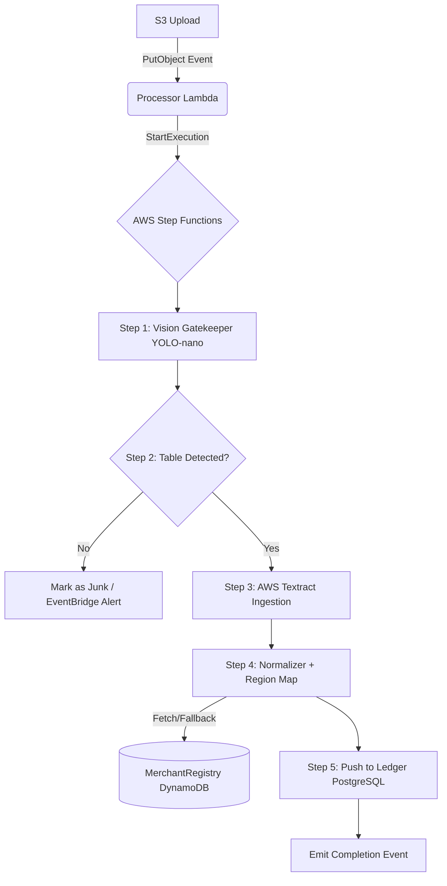

# Data Pipeline Service

The Data Pipeline Service is an asynchronous ingestion engine built with Python and orchestrated by AWS Step Functions. It handles the robust extraction, normalization, and categorization of raw financial data (PDF bank statements and bank-sync payloads) utilizing AWS AI services before pushing clean records into the core Ledger.

## Key Features & Impacts
* **Automated Data Ingestion:** Eliminates manual data entry by extracting transactions from uploaded PDF bank statements using AWS Textract and YOLO-nano computer vision models.
* **Intelligent Categorization:** Enriches raw merchant descriptions by mapping them against a centralized `FinTracker_MerchantRegistry` DynamoDB table, falling back to AWS Comprehend for semantic categorization when no exact match is found.
* **Junk Filtering:** Employs early-stage ML vision gates to detect non-tabular data, immediately terminating pipeline execution for junk uploads and alerting the system, saving compute costs.
* **Seamless Ledger Integration:** Transforms unstructured inputs into a standard schema, safely committing thousands of transactions into the PostgreSQL Ledger database.

## Architecture

The pipeline uses an event-driven architecture orchestrated by AWS Step Functions (defined via ASL), ensuring reliable retries, error handling, and visual observability of the ingestion process.


*(For complete system diagrams, see `/docs/fintracker-architectural-doc.md`)*

## Tech Stack
* **Frontend:** Angular (via fintracker-ui)
* **Backend:** Python (Native Lambdas)
* **Cloud:** AWS (Step Functions, S3, Textract, Comprehend, DynamoDB, EventBridge)
* **DevOps:** Poetry, AWS CDK
* **Testing:** pytest

## Modules & Interfaces

**Event-Driven / Serverless Triggers**
| Event Source | Trigger/Pattern | Description |
|---|---|---|
| AWS S3 | `s3:ObjectCreated:*` | Fires when a user uploads a new PDF bank statement to the ingestion bucket, starting the Step Functions state machine. |
| API Gateway | Webhook payload | Accepts synchronized JSON transaction payloads from external banking integrations. |

*(Note: The main engine is not directly exposed via REST endpoints to ensure asynchronous processing.)*

## Core Workflows

* **PDF Ingestion & Vision Gating:** Uploaded files trigger a fast YOLO-nano model that verifies the presence of tabular financial data. Invalid files are rejected early, while valid files proceed to AWS Textract for heavy OCR.
* **Data Normalization & Enrichment:** Extracted text is normalized. Merchant strings are evaluated against a caching DynamoDB registry for instant categorization, with AWS Comprehend serving as the fallback NLP classifier.
* **Ledger Synchronization:** The finalized array of categorized transaction objects is safely pushed to the PostgreSQL instance via the Ledger Service API, concluding with a WebSocket push notification to the user's browser.

## Quick Start
<details>
<summary>Click to expand setup instructions</summary>

### Prerequisites
* Python 3.12+
* Poetry
* AWS CLI

### Installation
1.  **Clone the repository:**
    ```bash
    git clone https://github.com/vanKvo/fintracker.git
    cd fintracker/services/fintracker-data-pipeline
    ```
2.  **Install Dependencies:**
    ```bash
    poetry install
    ```
3.  **Run Tests:**
    Test the pipeline logic using `moto` decorators to emulate S3 and Step Functions locally:
    ```bash
    poetry run pytest
    ```
4.  **Deployment Packaging:**
    Prior to AWS CDK deployment, native Lambdas are packaged:
    ```bash
    pip install -t package/ .
    ```

</details>
