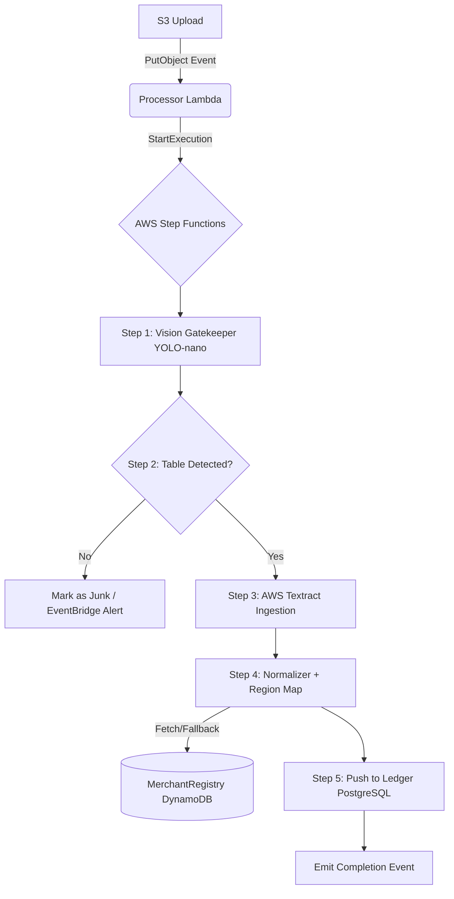

# Data Pipeline Service

## Summary
The asynchronous ingestion engine optimized for AWS Step Functions. It processes uploaded bank statements (PDFs) and bank-sync payloads, parses text utilizing AWS Textract, categorizes via `FinTracker_MerchantRegistry` and Comprehend, and pushes normalized rows into the Ledger.

## Local Setup
1. Uses Python 3.12+. Install `poetry`.
2. Run `poetry install`.
3. To test the pipeline logic, use `moto` decorators on pytest suites to emulate S3 and Step Functions locally. 

## Build, Test & Deploy
- **Build**: No heavy web framework. Uses native lambdas. `pip install -t package/` prior to Lambda zipping.
- **Test**: Run `poetry run pytest`.
- **Deploy**: AWS CDK defines both the Lambdas and the `AWS Step Functions State Machine` (ASL definition).

## Orchestration Flow
No direct REST endpoints expose the main engine. Entry is event-driven.

## Architecture

