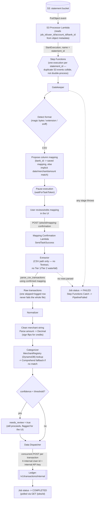

# Processing a CSV Bank Statement — Data Pipeline Flow

Scope: what happens inside the **Data Pipeline** service once a CSV statement lands in S3.
The upload itself (presigned URL, duplicate detection, statement record) is owned by the
Ledger and is covered in `uploading-csv-statement-flow.md` — this doc starts where that one
hands off (the S3 `PutObject` event) and ends where it resumes (the Ledger receiving
transactions).

## Diagram

## Logic flow

1. **Trigger.** The Ledger uploads directly to S3 (not through this service). S3's
   `PutObject` event invokes the S3 Processor Lambda, which starts one Step Functions
   execution named after the `statement_id` — reusing that ID (rather than minting a new
   job ID) is what lets the UI poll status with an ID it already has, and what makes a
   duplicate S3 event a no-op collision instead of a double-run.

2. **Gatekeeper — format detection + mapping proposal.** For a CSV, the Gatekeeper looks up
   a saved column mapping for the statement's bank (or falls back to matching columns
   literally named `date`/`merchant`/`amount`) and proposes it to the user. The execution
   then **pauses** (Step Functions `waitForTaskToken`) — this is the only stage that waits
   on a human, which is why the state machine is STANDARD rather than EXPRESS.

3. **Mapping confirmation.** The user reviews/corrects the mapping in the UI. Confirming
   calls a separate, directly-invoked Lambda (not part of the state machine chain) that
   resumes the paused execution with the confirmed mapping.

4. **Extractor — CSV path.** CSV never touches Textract or the PDF text-layer/OCR
   waterfall — it's a direct `csv.DictReader` parse using the confirmed mapping. A row that
   fails to parse is logged and skipped; it never fails the whole file. Note: statement
   metadata extraction (bank name, opening/closing date) only runs for PDF/Image pages
   today — the CSV path doesn't populate it.

5. **Normalizer.** Cleans the merchant string (strips reference numbers, lowercases),
   parses the amount into a signed `Decimal` (credits/returns go negative), then calls the
   Categorizer, which checks the DynamoDB `MerchantRegistry` first and falls back to AWS
   Comprehend on a cache miss. A row below the confidence threshold is still pushed, just
   flagged `needs_review` for the UI to prioritize.

6. **Data Dispatcher.** Pushes all normalized transactions to the Ledger's internal
   endpoint concurrently (bounded thread pool), authenticated as a trusted internal caller
   (`X-Internal-User-Id` + API key from SSM), never a user token. One transaction failing
   (after retry/backoff on throttling) doesn't block the rest of the batch.

7. **Failure handling.** Every stage records job status `FAILED` itself before re-raising;
   Step Functions `Catch` blocks additionally route any thrown error to a `Fail` state so
   the failure is visible in CloudWatch/Step Functions, not just the job-status table.
